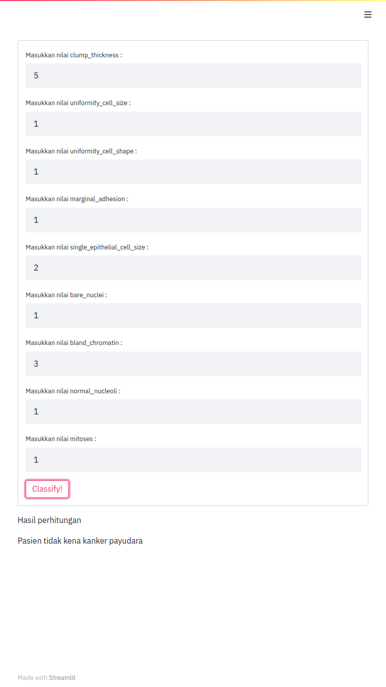

# Simple ML App
Buat Maba Sains Data UPN "Veteran" JaTim 2021<br><br>


## How to set up :notebook:
1. Clone the repo and get inside the directory
2. Install the third party packages
```
pip install -r requirements.txt
```
or
```
pip3 install -r requirements.txt
```
3. Run the app through your CMD/terminal
```
streamlit run main_app.py
```
4. Check your **http://localhost:8501** and have fun!
